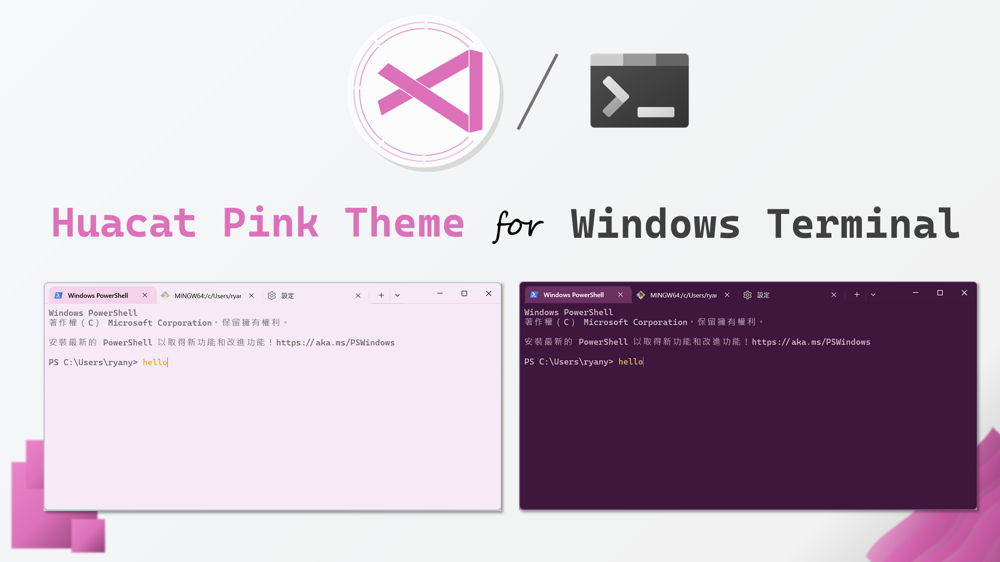
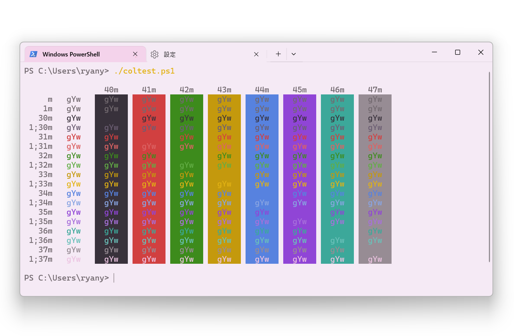
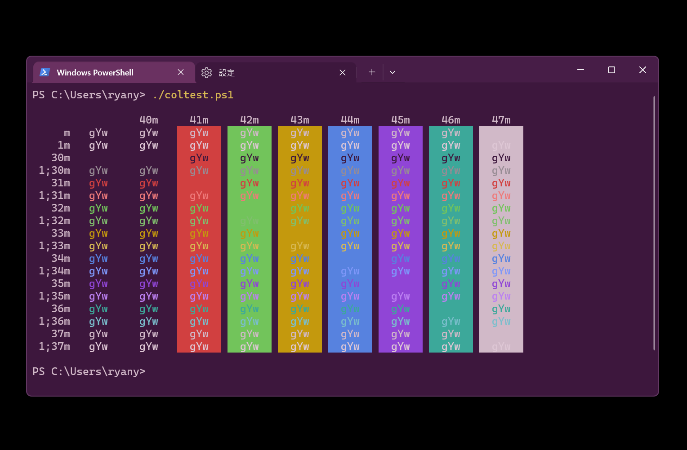

## Files
The theme is split into two files:
1. [schemes.jsonc](schemes.jsonc): 📄text and  `>_`console colorization
2. [themes.jsonc](themes.jsonc): 🪟window and tab colorization (*Only supports manual installation*)

## Installation
### Automatic Installation (Recommended)
> **Attention!** this method only works for color schemes, Windows Terminal doesn't support downloading theme fragments for now.\
See [#14002](https://github.com/microsoft/terminal/issues/14002) and [#16063](https://github.com/microsoft/terminal/issues/16063) for more information
- ✅[schemes.jsonc](schemes.jsonc): Supported
- ❌[themes.jsonc](themes.jsonc): *Currently not supported*
1. Open Powershell and run the following:
```powershell
Invoke-Webrequest -uri 'https://raw.githubusercontent.com/huacat-pink/windows-terminal/main/schemes.jsonc' -OutFile ( New-Item -Path "$($env:LOCALAPPDATA)\Microsoft\Windows Terminal\Fragments\Huacat Pink Theme\schemes.json" -Force )
```
> This will download the scheme and the theme automatically to your disk
2. **Restart Windows Terminal** to make the theme available for use

### Manual Installation
- ✅[schemes.jsonc](schemes.jsonc): Supported
- ✅[themes.jsonc](themes.jsonc): Supported
1. Launch Windows Terminal
2. Open Settings Panel (or by `Ctrl`+`,`)
3. Select "Open JSON File" at bottom left corner (or by `Ctrl` + `Shift` + `,`) to open `settings.json`
4. Copy the config inside the `schemes: []` array in file [schemes.jsonc](schemes.jsonc) to the `schemes` list in `settings.json`
```jsonc
{
    "profiles":[...],
    //...
    "schemes": [
        ..Other schemes
        {
            "name": "Huacat Pink Theme",
            "background": "#f5eaf5",
            ..
        },
        {
            "name": "Huacat Pink dark",
            "background": "#3d173d",
            ..
        }
    ]
}
```
5. Copy the config inside the `themes: []` array in file [themes.jsonc](themes.jsonc) to the `themes` list in `settings.json`
```jsonc
{
    ...
    "themes": [
        {
            "name": "Huacat Pink Theme",
            "tab": {...},
            "tabRow": {...},
            "window":  {...}
        },
        {
            "name": "Huacat Pink Dark",
            ... 
        }
    ]
}
```
6. **Restart the Terminal** and the theme is available for use.

### After Installing
#### To Activate the color scheme (for text and console)
1. Open Settings in Windows Terminal 
2. Under Profiles, choose the profile you'd like to apply the scheme to. (the "Defaults" profile will apply theme to all profiles)
3. Select Appearance
4. Choose your favorite on the `Color Scheme` dropdown

#### To Activate the theme for windows and tabs
1. Open Settings in Windows Terminal
2. Check Appearance and Select `Application Theme` to choose whatever you want

#### Last Step
Click the `Save` button and enjoy the theme⚡!

## Screenshots
### Huacat Pink Theme (Light)

### Huacat Pink Dark


## References

- [catppuccin/windows-terminal](https://github.com/catppuccin/windows-terminal)
- [Serendipity-Theme/windows-terminal](https://github.com/Serendipity-Theme/windows-terminal)
